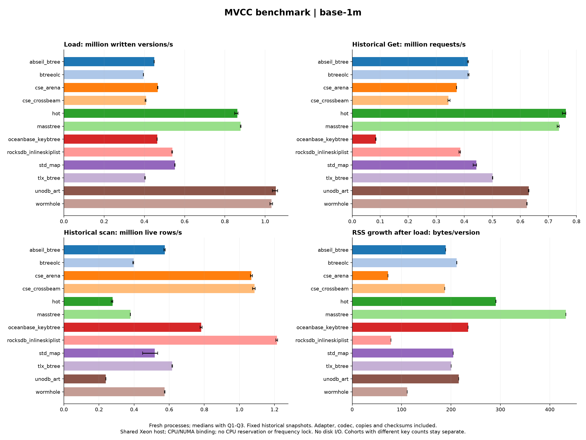

# Completed MVCC matrix — 2026-10-08/09

Completed **906 fresh processes / 2,928 phase rows**, with three repetitions
and **288 matching count/content comparison groups**. Linux x86-64, GCC 11.3.1,
Rust stable 1.92.0, shared dual-socket Intel Xeon Gold 6240 host. Processes ran
serially, bound to physical CPUs 2–9 and NUMA node 0. CPU frequency and
background services were not controlled.

The run started **2026-10-08 22:02:40** and finished **2026-10-09 06:34:58**
(Asia/Shanghai), about **8 h 32 min** including the capacity failure and resume.
The directory date identifies the start date. The post-run Linux test gate
passed **17/17**; see [CTest](ctest.log).

## Cohorts

| Cohort | User keys | Initial versions/key | Key/value bytes | Snapshot lag | Candidates | Processes | Phase rows |
| --- | --- | --- | --- | --- | --- | --- | --- |
| base-1m | 1,000,000 | 4 | 16 / 32 | 2 | 12 | 156 | 504 |
| deep-1m | 1,000,000 | 16 | 16 / 32 | 15 | 11 | 141 | 456 |
| prefix-1m | 1,000,000 | 4 | 32 / 32; shared prefix 24 B | 2 | 12 | 156 | 504 |
| value-1m | 1,000,000 | 4 | 16 / 1,024 | 2 | 11 | 141 | 456 |
| deep-500k | 500,000 | 16 | 16 / 32 | 15 | 12 | 156 | 504 |
| value-100k | 100,000 | 4 | 16 / 1,024 | 2 | 12 | 156 | 504 |

The first four cohorts comprise **594 processes / 1,920 rows**. The matched
supplements comprise **312 processes / 1,008 rows**. Their different populations
are kept separate in every table and figure. The two million-key capacity
exclusions are CSE Arena; all other candidates completed those cohorts.

Each cohort uses seeds 42/43/44, one million operations, batch size 32, uniform
access, 80% reads in the read-request/written-version budget, 10% scans among
reads, scan length 100, 10% absent point probes, and 10% deterministic deletion
generation after the first live round. Actual counts remain in raw CSV rather
than being inferred from requested shares. There is a disjoint miss corpus
with the same population size. Writes are shuffled within increasing version
rounds. Stage-1 scan phases use 1,024 starting keys. There are no separate warmup runs.

- **Stage 1:** load; latest/historical Get; latest/historical visible range scan.
- **Stage 2:** one mixed worker for every candidate; 4/8 workers, consisting of
  one writer plus readers, for native concurrent candidates. All readers use a
  fixed historical snapshot from completed prefill.
- **Stage 3:** load → Freeze → ordered flush of every retained version and
  tombstone → Destroy.

std::map, Abseil, TLX and HOTSingleThreaded run only with one worker. RocksDB,
BTreeOLC, UnoDB, Masstree, Wormhole, OceanBase KeyBtree and both CSE backends
are eligible for SWMR, subject to the cohort's capacity exclusions. CSE uses
native per-user-key version chains; the ten ordered indexes use InternalKeys.

## Findings

These are descriptive three-repeat medians on this host. The
[complete tables](summary/report.md) and [median/quartile CSV](summary/summary.csv)
include all candidates, phases and available metrics.

- **Load and point reads:** in base-1m, UnoDB/Wormhole load 1.053/1.032 million
  versions/s; HOT/Masstree historical Get reaches 0.762/0.738 million requests/s.
  RocksDB reaches 0.539 million versions/s and 0.386 million historical Get/s.
  This pattern is visible in the deep/prefix cohorts too. Absolute rates fall
  in the large-value cohort; payload copying is included.
- **Visible scans and lifecycle:** RocksDB has the highest historical scan
  median within each of the six cohorts. Base-1m is 1.214 million live rows/s,
  versus 1.086/1.068 for CSE Crossbeam/Arena. Base flush is 5.524 million
  versions/s for RocksDB and 5.396 for Wormhole. Deep-history flush has Wormhole
  ahead of RocksDB; the 1 KiB value cohorts have TLX ahead, with medians
  0.725/0.735 million versions/s in value-1m/value-100k.
- **Memory:** base-1m RSS growth is 72.3 B/version for CSE Arena, 78.7 for
  RocksDB and 111.5 for Wormhole. CSE Arena has the lowest median in the four
  cohorts it supports. Its capacity limits are part of the comparison.
  RSS includes runtime/allocator retention and is not backend allocation size.
- **History and value size:** with 16 versions and snapshot lag 15, RocksDB's
  historical scan changes from 1.214 to 0.320 million live rows/s, and CSE
  Crossbeam from 1.086 to 0.270. The deep profile changes both history depth and
  snapshot lag. With 1 KiB values, RocksDB's scan is 0.409 million live rows/s
  and UnoDB/Wormhole load is 0.611/0.646 million versions/s. The scan hashes
  payloads, so these are complete operation-path costs.
- **SWMR:** base-1m at eight workers reaches 0.569 million aggregate requests/s
  for RocksDB, 0.545 for CSE Crossbeam and 0.535 for CSE Arena. Crossbeam's
  medians exceed RocksDB's in deep-1m and value-1m. Group wall time includes
  the read tail after the finite write budget. This does not measure parallel
  writers or pure read-only scaling.



Other single-thread figures: [deep-1m](summary/deep-1m.png),
[prefix-1m](summary/prefix-1m.png), [value-1m](summary/value-1m.png),
[deep-500k](summary/deep-500k.png), [value-100k](summary/value-100k.png).
Each also has an SVG and a `*-swmr.png`/SVG figure.

## CSE Arena capacity exclusions

The pinned native allocator has a uint32 allocation counter and an encoded
block-index limit. The million-key, four-version, 1 KiB value case is rejected
by the harness's conservative allocation guard before producing phase output.
The first million-key deep-history attempt exhausted native block index 254
during prefill. [Exclusions](unsupported-cases.json) and [failure records](failures/)
preserve the evidence; no failed measurement is counted among the 906 processes.

For these small allocations, the native growth schedule provides about 656 MiB
per node/value segment before alignment and unused tails. This is a nominal
schedule, not a universal hard byte ceiling: a larger individual allocation
can raise a block's minimum capacity. Native engine sources and the measured
binary were unchanged. Successful four-worker [capacity probes](capacity-checks/)
preceded the matched deep-500k/value-100k cohorts; these two probes are excluded
from the formal process and row counts.

## Measurement boundaries

- Batches are submissions, not atomic transactions. Snapshots are fixed
  completed-round timestamps; no moving snapshots, conflict resolution or
  multiwriter MVCC scaling is measured.
- Timings include adapters, key encoding, ownership, value copying/hashing,
  synchronization and Rust FFI. Load is written versions/s; Get is requests/s;
  visible scan is live rows/s; flush is all retained versions/s.
- Phase elapsed time includes PMU start/stop. This dominates the one-call
  Freeze phase. Tables separately show the sampled call duration, which still
  includes clock/call instrumentation. Neither is a stable native-only Freeze
  latency estimate. Stage-1 scan p99 has only about 16 samples per repetition.
  Reader service latency mixes Get and Scan; aggregate SWMR latency is absent.
- OceanBase is the KeyBtree core port with common InternalKey visibility.
  GetAt fills its first 225-entry iterator batch. This does not measure full
  ObMemtable transaction/version-chain behavior.
- No WAL, SST encoding or disk I/O is measured. Three repeats provide
  descriptive quartiles, not confidence intervals. Shared-host interference
  remains possible despite affinity and NUMA binding.
- Cycles, instructions, L1/LLC misses and branch misses are available in all
  2,928 rows; DTLB in 2,709. Missing fields are empty, not zero.

## Evidence and reproduction

Measured source commit: `c3063120e6d0d2e3a25676901f40c26709867f78`.
Measured `mvcc_bench` SHA-256:
`3bbc39845116a756a05c731b1f59c25fb13967cb2b8b7ba99619dca171a17999`.
All six cohorts used this binary and the same source manifest. Reporting scripts
and current documentation were added after measurement.

- [coordinator.json](coordinator.json) and `run_formal.py` preserve the six exact
  cohort commands, exclusions, completion counts and timestamps. Recorded
  absolute paths describe the Linux server; adapt them for a fresh rerun.
- Each cohort has unchanged `raw.csv`/`metadata.json`, a process-files SHA-256
  manifest and `process-records.tar.gz` containing original commands, logs and
  per-process CSVs. [Record checks](records-verification.json) verify that raw
  rows match the original process CSVs and packed bytes match every manifest.
- [build-record.json](build-record.json), [final-integrity.json](final-integrity.json),
  `source-files.json` and `source-snapshot.tar.gz` retain the measured build,
  topology, dependency pins and 75 public source/document files. No CSE engine
  sources, linked binary or full dependency checkout is redistributed.
- [validation.json](summary/validation.json) records complete-matrix/content
  checks and PMU availability. [archive.json](archive.json) hashes published files.
- `reporting-sources/` retains the exact postprocessing scripts, their hashes
  and optional plot environment. Summary validation uses only Python's standard
  library; plotting requires Matplotlib/NumPy.

Recreate derived reports in an ignored output directory:

```sh
python3 scripts/summarize_mvcc.py \
  benchmarks/mvcc-formal-1m-2026-10-08/{base-1m,deep-1m,prefix-1m,value-1m,deep-500k,value-100k} \
  --output results/mvcc-review
python3 scripts/plot_mvcc.py results/mvcc-review

# Restore a cohort's original process records when needed.
tar -xzf benchmarks/mvcc-formal-1m-2026-10-08/base-1m/process-records.tar.gz \
  -C benchmarks/mvcc-formal-1m-2026-10-08/base-1m
```

These `mvcc-v1` rows must be kept separate from the older exact-key CSV v3
archives. This matrix includes the current Wormhole alignment, UnoDB restart
and HOT lower-bound fixes.
